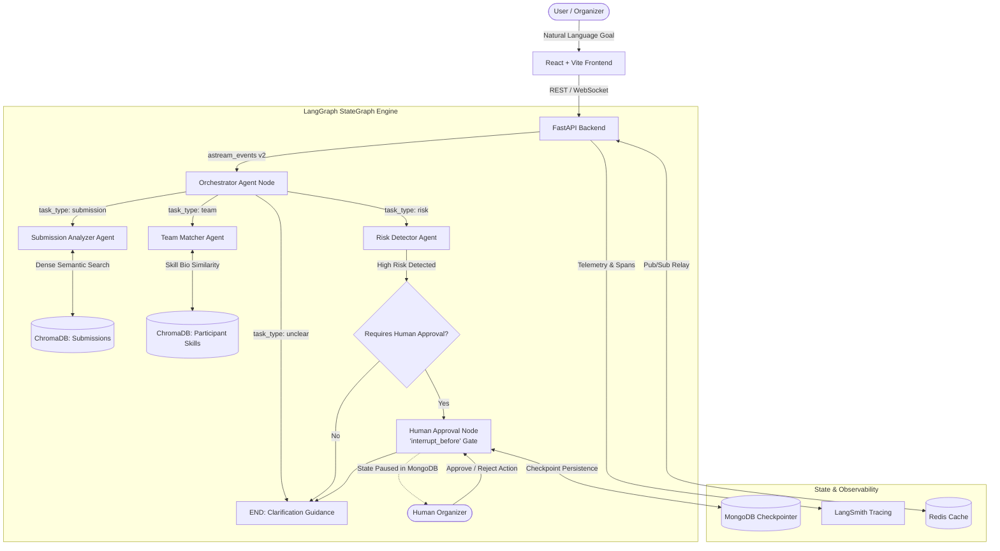

# ⚡ Autonomous Multi-Agent Hackathon Orchestrator

[](https://fastapi.tiangolo.com/)
[](https://langchain-ai.github.io/langgraph/)
[](https://ai.google.dev/)
[](https://www.trychroma.com/)
[](https://www.mongodb.com/)
[](https://redis.io/)
[](https://react.dev/)

> **A production-grade, stateful Multi-Agent Orchestration Platform for Hackathon Management.** Built for automated project evaluation, semantic novelty scoring, anomaly/risk detection, and dynamic team formation using **LangGraph**, **ChromaDB**, and **Native Human-in-the-Loop Interrupt Checkpoints**.

---

## 📑 Table of Contents
- [Project Overview](#-project-overview)
- [System Design & Multi-Agent Architecture](#-system-design--multi-agent-architecture)
- [Technology Stack & Architectural Justifications](#-technology-stack--architectural-justifications)
- [Specialist Agents Breakdown](#-specialist-agents-breakdown)
- [Human-in-the-Loop Interrupt Gate](#-human-in-the-loop-interrupt-gate)
- [Real-Time Streaming & Observability](#-real-time-streaming--observability)
- [Quickstart & Local Execution Guide](#-quickstart--local-execution-guide)
- [API & WebSocket Reference](#-api--websocket-reference)
- [Directory Structure](#-directory-structure)

---

## 🎯 Project Overview

Managing modern hackathons with hundreds of teams presents severe operational bottlenecks:
1. **Submission Triage**: Evaluating project novelty, technical depth, and completeness manually is slow and subjective.
2. **Integrity & Risk**: Detecting vote brigading, plagiarism, or collusion in real time is virtually impossible with static heuristics.
3. **Team Formation**: Keyword-matching participants on tags misses latent skills, project vision, and team compatibility.

### Why Multi-Agent?
Instead of a monolithic prompt or brittle if-else chains, this system deploys **autonomous, specialized AI agents** operating on a unified **LangGraph StateGraph**. Agents share state, execute domain-specific vector queries, and yield control to human organizers when high-risk anomalies are identified.

---

## 🏛 System Design & Multi-Agent Architecture


### Visual State Flow & Execution Lifecycle
```
[User Input] 
     │
     ▼
[Orchestrator Node] ───► Structured Intent Classification (Pydantic Schema)
     │
     ├──► [Submission Agent] ───► ChromaDB Vector Search ───► Novelty & Rubric Scoring ───► END
     ├──► [Team Agent]       ───► ChromaDB Skill Search  ───► Compatibility Matrix   ───► END
     └──► [Risk Agent]       ───► Anomaly Classification 
                                        │
                       ┌────────────────┴────────────────┐
                       ▼                                 ▼
               [Low/Medium Risk]                  [High Risk Detected]
                       │                                 │
                      END                 [interrupt_before: human_approval]
                                                         │
                                               (Execution Suspended)
                                                         │
                                              [MongoDB Checkpoint Saved]
                                                         │
                                             (Human Approves/Rejects)
                                                         │
                                               (Execution Resumes)
                                                         │
                                                        END
```

---

## 🛠 Technology Stack & Architectural Justifications

| Component | Technology | Why This Specific Tool Was Chosen |
|---|---|---|
| **Agent Orchestration** | **LangGraph (StateGraph)** | Replaces unstable auto-agent loops with a deterministic, cyclic/acyclic state machine. Provides native graph compilation, conditional edge routing, and built-in `interrupt_before` pause/resume mechanics. |
| **LLM Engine** | **Google Gemini (Flash-Lite)** | High-speed inference and massive context capacity paired with cost efficiency. Strict native JSON schema enforcement prevents confabulation. |
| **Vector Database** | **ChromaDB + all-MiniLM-L6-v2** | Performs local 384-dimensional dense semantic vector similarity searches with low latency. Detects conceptual prior art and matches talent without keyword overlap. |
| **State Persistence** | **MongoDB via MongoDBSaver** | Checkpoints complete agent graph state (conversation history, tool payloads, routing decisions) at every node. Allows paused workflows to sleep and resume without state loss. |
| **Realtime Transport** | **FastAPI WebSockets** | Streams `astream_events` (v2) tokens, node transitions, and tool outputs directly to the UI for sub-second reactive transparency. |
| **Cache & Pub/Sub** | **Redis (async redis-py)** | Decouples WebSocket event broadcasting across horizontal worker nodes and provides sub-millisecond caching for agent state lookups. |
| **Observability** | **LangSmith + structlog** | Production-grade tracing capturing full execution DAGs, token latencies, tool IO payloads, and structured error logs with zero manual code wrapping. |
| **Frontend UI** | **React 18 + Vite + TailwindCSS** | Instant HMR, minimal bundle size, and responsive dark-mode UI with live interactive timelines, visual architecture diagrams, and human approval modals. |

---

## 🤖 Specialist Agents Breakdown

### 1. 🧭 Orchestrator Agent (`orchestrator_agent.py`)
- **Role**: Entry point for natural language requests.
- **Mechanism**: Employs Gemini with structured Pydantic output schemas to classify incoming objectives into `submission`, `risk`, `team`, or `unclear`.
- **Anti-Confabulation Guard**: Implements a strict 4th "unclear" classification fallback with prompt constraints to prevent the model from fabricating routing reasons for greetings or vague inputs.

### 2. 📝 Submission Analyzer Agent (`submission_agent.py`)
- **Role**: Evaluates project submissions across multi-dimensional criteria.
- **Capabilities**:
  - Scores Innovation, Technical Complexity, and Completeness (1–10).
  - Uses `find_similar_submissions` tool to query ChromaDB for semantic prior art.
  - Generates detailed novelty assessments and identifies potential duplicates regardless of keyword variation.

### 3. 🛡️ Risk Detector Agent (`risk_agent.py`)
- **Role**: Hackathon integrity monitor.
- **Capabilities**:
  - Classifies anomalies (e.g., vote brigading clusters, suspicious submission timestamps, AI code plagiarism).
  - Categorizes severity: `LOW`, `MEDIUM`, or `HIGH`.
  - Automatically flags `requires_human_approval = True` when critical thresholds are breached.

### 4. 👥 Team Matcher Agent (`team_agent.py`)
- **Role**: Autonomous talent coordinator.
- **Capabilities**:
  - Analyzes team skill gaps (e.g., "We have smart contract devs but need a Web3 React frontend specialist").
  - Queries `find_matching_participants` in ChromaDB to locate candidates by semantic bio relevance rather than static filter tags.
  - Outputs compatibility reasoning and recommended roles.

---

## 🛑 Human-in-the-Loop Interrupt Gate

Unlike naive systems that use application-level `if` checks, this platform leverages LangGraph's native compiler-level interrupt:

```python
# backend/ai/graph/build_graph.py
graph = builder.compile(
    checkpointer=mongo_checkpointer,
    interrupt_before=["human_approval"]
)
```

### How the Interrupt Protocol Works:
1. **Trigger**: When `Risk Detector` flags a `HIGH` risk, the conditional edge `needs_approval` routes to `human_approval`.
2. **State Freeze**: LangGraph pauses execution **before** running `human_approval`. The complete state snapshot is committed to MongoDB under the task's `thread_id`.
3. **Review**: The frontend receives a notification and displays a Human-in-the-Loop modal with risk evidence.
4. **Resumption**:
   - **Approve**: Organizers approve with a note $\rightarrow$ Backend calls `graph.ainvoke(None, config)` $\rightarrow$ Graph completes execution.
   - **Reject**: Organizers reject $\rightarrow$ Backend updates state via `graph.aupdate_state()` $\rightarrow$ Flow halts safely without destructive side effects.

---

## 📡 Real-Time Streaming & Observability

### LangSmith Tracing
Every single agent node, tool call, prompt template, and model response is automatically traced by setting:
```bash
LANGCHAIN_TRACING_V2=true
LANGCHAIN_API_KEY=your_key_here
LANGCHAIN_PROJECT=hackathon-orchestrator
```
Inspect exact latency per node, token counts, and full state transformations in real time at [smith.langchain.com](https://smith.langchain.com).

### Live WebSocket Stream (`/ws/ai/tasks/{task_id}`)
The UI connects directly to a WebSocket pipeline receiving `astream_events` (v2) payloads:
- `on_chat_model_stream`: Live streaming tokens.
- `on_tool_start` / `on_tool_end`: Visual indicators of vector DB queries.
- `on_chain_start` / `on_chain_end`: Step-by-step agent transitions on the `AIActivityTimeline`.

---

## 🚀 Quickstart & Local Execution Guide

### Prerequisites
- Python 3.10 or 3.11
- Node.js 18+ & npm
- Docker & Docker Compose

### 1. Launch Infrastructure (Docker)
```bash
# Start MongoDB (27017), Redis (6379), and ChromaDB (8000)
docker compose up -d
```

### 2. Configure Backend Environment
```bash
cd backend
cp .env.example .env
```
Ensure `.env` contains your Gemini API key:
```env
AI_API_KEY=your_gemini_api_key
AI_MODEL=gemini-flash-lite-latest
LANGCHAIN_TRACING_V2=true
LANGCHAIN_API_KEY=your_langsmith_key
LANGCHAIN_PROJECT=hackathon-orchestrator
```

### 3. Install Backend Dependencies & Seed Vector DB
```bash
pip install -r requirements.txt

# Seed ChromaDB with 16 sample submissions and 10 participant skill bios
python -m backend.scripts.seed
```

### 4. Start the FastAPI Backend
```bash
# Note: Runs on port 8080 (port 8000 is reserved for ChromaDB)
python -m uvicorn backend.main:app --port 8080 --reload
```

### 5. Start the React Frontend
```bash
cd ../frontend
npm install
npm run dev
```
Open [http://localhost:5173](http://localhost:5173) in your browser.

---

## 🔌 API & WebSocket Reference

### REST Endpoints
| Method | Endpoint | Description |
|---|---|---|
| `POST` | `/api/ai/orchestrate` | Accepts `{ "goal": "..." }`, initializes graph, and returns `task_id`. |
| `GET` | `/api/ai/tasks/{task_id}/pending` | Returns current pending state if paused at human interrupt gate. |
| `POST` | `/api/ai/tasks/{task_id}/approve` | Submits human decision (`approve` or `reject`) with reviewer notes. |
| `GET` | `/api/ai/status` | System health check and agent connectivity status. |

### WebSocket Endpoint
```
ws://localhost:8080/ws/ai/tasks/{task_id}
```
Emits typed event packets for real-time UI timeline rendering.

---

## 📂 Directory Structure

```
Hackathon_Multi-Agent_Orchestrator/
├── ARCHITECTURE.md              # In-depth architectural documentation
├── DECISIONS.md                 # Architectural decision records (ADRs)
├── DEMO_SCRIPT.md               # 5-minute rehearsed live demo script
├── PROJECT_CONTEXT.md           # Engineering constraints & scope
├── docker-compose.yml           # MongoDB, Redis, and ChromaDB definitions
├── backend/
│   ├── ai/
│   │   ├── agents/              # LangGraph node implementations
│   │   │   ├── orchestrator_agent.py
│   │   │   ├── submission_agent.py
│   │   │   ├── risk_agent.py
│   │   │   ├── team_agent.py
│   │   │   └── human_approval_node.py
│   │   ├── graph/               # State schema & graph compilation
│   │   │   ├── state.py
│   │   │   └── build_graph.py
│   │   ├── tools/               # ChromaDB vector retrieval tools
│   │   │   ├── submission_tools.py
│   │   │   └── team_tools.py
│   │   └── prompts/             # System prompts with injection guards
│   ├── db/                      # Mongo, Redis, and ChromaDB clients
│   ├── models/                  # Beanie ODM schemas (AITask, AIRisk, etc.)
│   ├── routers/                 # FastAPI REST and WebSocket endpoints
│   ├── scripts/seed.py          # Vector embeddings & database seed script
│   └── main.py                  # FastAPI application entrypoint
└── frontend/
    └── src/
        ├── components/          # Activity timeline, approval modals, architecture viewer
        ├── hooks/               # WebSocket event listeners & state hooks
        └── App.jsx              # Main orchestrator dashboard
```

---

## ⚖️ License
Distributed under the MIT License. See `LICENSE` for more information.

| Layer            | Technology              |
| ---------------- | ----------------------- |
| Frontend         | React / JavaScript      |
| Backend          | Python / FastAPI        |
| AI               | LLM / AI API            |
| Database         | MongoDB                 |
| Cache / Queue    | Redis                   |
| Vector Database  | ChromaDB                |
| API Server       | Uvicorn                 |
| Containerization | Docker / Docker Compose |
| Version Control  | Git / GitHub            |

---

## 📂 Project Documentation

Before making changes, developers should understand the project's existing documentation.

Read these files in order:

1. **`PROJECT_CONTEXT.md`** — project purpose, scope, technology stack, and important context
2. **`PROGRESS.md`** — current implementation status and active work
3. **`DECISIONS.md`** — finalized technical decisions
4. **`ARCHITECTURE.md`** — system architecture, graph structure, state shape, and endpoints

Additional project documentation may include:

* `DEPLOYMENT.md`
* `DEMO_SCRIPT.md`
* `FAILURE_LOG.md`

---

## 🚀 Quick Start

### Prerequisites

Make sure the following are installed:

* Git
* Docker
* Docker Compose
* Python 3.x
* Node.js
* npm

Verify your installations:

```bash
git --version
docker --version
docker compose version
python --version
node --version
npm --version
```

---

## 1. Clone the Repository

```bash
git clone https://github.com/Pravinchavan321/Hackathon_Multi-Agent_Orchestrator.git
cd Hackathon_Multi-Agent_Orchestrator
```

---

## 2. Start Infrastructure Services

Start MongoDB, Redis, and ChromaDB using Docker Compose:

```bash
docker compose up -d
```

Check running containers:

```bash
docker compose ps
```

---

## 3. Configure Backend Environment

Navigate to the backend:

```bash
cd backend
```

Create the environment file:

```bash
cp .env.example .env
```

On Windows PowerShell, if `cp` is unavailable:

```powershell
Copy-Item .env.example .env
```

Update `.env` with the required configuration.

At minimum, configure the required AI API key:

```env
AI_API_KEY=your_api_key_here
```

Do not commit `.env` or expose API keys publicly.

---

## 4. Install Backend Dependencies

```bash
pip install -r requirements.txt
```

---

## 5. Start the FastAPI Backend

```bash
uvicorn main:app --reload --port 8080
```

The backend runs locally on:

```text
http://localhost:8080
```

FastAPI uses port **8080** locally because ChromaDB uses port **8000** in the current development configuration.

FastAPI's interactive API documentation is available at:

```text
http://localhost:8080/docs
```

---

## 6. Start the Frontend

Open another terminal from the project root:

```bash
cd frontend
```

Install dependencies:

```bash
=======
[](https://fastapi.tiangolo.com/)
[](https://langchain-ai.github.io/langgraph/)
[](https://ai.google.dev/)
[](https://www.trychroma.com/)
[](https://www.mongodb.com/)
[](https://redis.io/)
[](https://react.dev/)

> **A production-grade, stateful Multi-Agent Orchestration Platform for Hackathon Management.** Built for automated project evaluation, semantic novelty scoring, anomaly/risk detection, and dynamic team formation using **LangGraph**, **ChromaDB**, and **Native Human-in-the-Loop Interrupt Checkpoints**.

---

## 📑 Table of Contents
- [Project Overview](#-project-overview)
- [System Design & Multi-Agent Architecture](#-system-design--multi-agent-architecture)
- [Technology Stack & Architectural Justifications](#-technology-stack--architectural-justifications)
- [Specialist Agents Breakdown](#-specialist-agents-breakdown)
- [Human-in-the-Loop Interrupt Gate](#-human-in-the-loop-interrupt-gate)
- [Real-Time Streaming & Observability](#-real-time-streaming--observability)
- [Quickstart & Local Execution Guide](#-quickstart--local-execution-guide)
- [API & WebSocket Reference](#-api--websocket-reference)
- [Directory Structure](#-directory-structure)

---

## 🎯 Project Overview

Managing modern hackathons with hundreds of teams presents severe operational bottlenecks:
1. **Submission Triage**: Evaluating project novelty, technical depth, and completeness manually is slow and subjective.
2. **Integrity & Risk**: Detecting vote brigading, plagiarism, or collusion in real time is virtually impossible with static heuristics.
3. **Team Formation**: Keyword-matching participants on tags misses latent skills, project vision, and team compatibility.

### Why Multi-Agent?
Instead of a monolithic prompt or brittle if-else chains, this system deploys **autonomous, specialized AI agents** operating on a unified **LangGraph StateGraph**. Agents share state, execute domain-specific vector queries, and yield control to human organizers when high-risk anomalies are identified.

---

## 🏛 System Design & Multi-Agent Architecture



### Visual State Flow & Execution Lifecycle
```
[User Input] 
     │
     ▼
[Orchestrator Node] ───► Structured Intent Classification (Pydantic Schema)
     │
     ├──► [Submission Agent] ───► ChromaDB Vector Search ───► Novelty & Rubric Scoring ───► END
     ├──► [Team Agent]       ───► ChromaDB Skill Search  ───► Compatibility Matrix   ───► END
     └──► [Risk Agent]       ───► Anomaly Classification 
                                        │
                       ┌────────────────┴────────────────┐
                       ▼                                 ▼
               [Low/Medium Risk]                  [High Risk Detected]
                       │                                 │
                      END                 [interrupt_before: human_approval]
                                                         │
                                               (Execution Suspended)
                                                         │
                                              [MongoDB Checkpoint Saved]
                                                         │
                                             (Human Approves/Rejects)
                                                         │
                                               (Execution Resumes)
                                                         │
                                                        END
```

---

## 🛠 Technology Stack & Architectural Justifications

| Component | Technology | Why This Specific Tool Was Chosen |
|---|---|---|
| **Agent Orchestration** | **LangGraph (StateGraph)** | Replaces unstable auto-agent loops with a deterministic, cyclic/acyclic state machine. Provides native graph compilation, conditional edge routing, and built-in `interrupt_before` pause/resume mechanics. |
| **LLM Engine** | **Google Gemini (Flash-Lite)** | High-speed inference and massive context capacity paired with cost efficiency. Strict native JSON schema enforcement prevents confabulation. |
| **Vector Database** | **ChromaDB + all-MiniLM-L6-v2** | Performs local 384-dimensional dense semantic vector similarity searches with low latency. Detects conceptual prior art and matches talent without keyword overlap. |
| **State Persistence** | **MongoDB via MongoDBSaver** | Checkpoints complete agent graph state (conversation history, tool payloads, routing decisions) at every node. Allows paused workflows to sleep and resume without state loss. |
| **Realtime Transport** | **FastAPI WebSockets** | Streams `astream_events` (v2) tokens, node transitions, and tool outputs directly to the UI for sub-second reactive transparency. |
| **Cache & Pub/Sub** | **Redis (async redis-py)** | Decouples WebSocket event broadcasting across horizontal worker nodes and provides sub-millisecond caching for agent state lookups. |
| **Observability** | **LangSmith + structlog** | Production-grade tracing capturing full execution DAGs, token latencies, tool IO payloads, and structured error logs with zero manual code wrapping. |
| **Frontend UI** | **React 18 + Vite + TailwindCSS** | Instant HMR, minimal bundle size, and responsive dark-mode UI with live interactive timelines, visual architecture diagrams, and human approval modals. |

---

## 🤖 Specialist Agents Breakdown

### 1. 🧭 Orchestrator Agent (`orchestrator_agent.py`)
- **Role**: Entry point for natural language requests.
- **Mechanism**: Employs Gemini with structured Pydantic output schemas to classify incoming objectives into `submission`, `risk`, `team`, or `unclear`.
- **Anti-Confabulation Guard**: Implements a strict 4th "unclear" classification fallback with prompt constraints to prevent the model from fabricating routing reasons for greetings or vague inputs.

### 2. 📝 Submission Analyzer Agent (`submission_agent.py`)
- **Role**: Evaluates project submissions across multi-dimensional criteria.
- **Capabilities**:
  - Scores Innovation, Technical Complexity, and Completeness (1–10).
  - Uses `find_similar_submissions` tool to query ChromaDB for semantic prior art.
  - Generates detailed novelty assessments and identifies potential duplicates regardless of keyword variation.

### 3. 🛡️ Risk Detector Agent (`risk_agent.py`)
- **Role**: Hackathon integrity monitor.
- **Capabilities**:
  - Classifies anomalies (e.g., vote brigading clusters, suspicious submission timestamps, AI code plagiarism).
  - Categorizes severity: `LOW`, `MEDIUM`, or `HIGH`.
  - Automatically flags `requires_human_approval = True` when critical thresholds are breached.

### 4. 👥 Team Matcher Agent (`team_agent.py`)
- **Role**: Autonomous talent coordinator.
- **Capabilities**:
  - Analyzes team skill gaps (e.g., "We have smart contract devs but need a Web3 React frontend specialist").
  - Queries `find_matching_participants` in ChromaDB to locate candidates by semantic bio relevance rather than static filter tags.
  - Outputs compatibility reasoning and recommended roles.

---

## 🛑 Human-in-the-Loop Interrupt Gate

Unlike naive systems that use application-level `if` checks, this platform leverages LangGraph's native compiler-level interrupt:

```python
# backend/ai/graph/build_graph.py
graph = builder.compile(
    checkpointer=mongo_checkpointer,
    interrupt_before=["human_approval"]
)
```

### How the Interrupt Protocol Works:
1. **Trigger**: When `Risk Detector` flags a `HIGH` risk, the conditional edge `needs_approval` routes to `human_approval`.
2. **State Freeze**: LangGraph pauses execution **before** running `human_approval`. The complete state snapshot is committed to MongoDB under the task's `thread_id`.
3. **Review**: The frontend receives a notification and displays a Human-in-the-Loop modal with risk evidence.
4. **Resumption**:
   - **Approve**: Organizers approve with a note $\rightarrow$ Backend calls `graph.ainvoke(None, config)` $\rightarrow$ Graph completes execution.
   - **Reject**: Organizers reject $\rightarrow$ Backend updates state via `graph.aupdate_state()` $\rightarrow$ Flow halts safely without destructive side effects.

---

## 📡 Real-Time Streaming & Observability

### LangSmith Tracing
Every single agent node, tool call, prompt template, and model response is automatically traced by setting:
```bash
LANGCHAIN_TRACING_V2=true
LANGCHAIN_API_KEY=your_key_here
LANGCHAIN_PROJECT=hackathon-orchestrator
```
Inspect exact latency per node, token counts, and full state transformations in real time at [smith.langchain.com](https://smith.langchain.com).

### Live WebSocket Stream (`/ws/ai/tasks/{task_id}`)
The UI connects directly to a WebSocket pipeline receiving `astream_events` (v2) payloads:
- `on_chat_model_stream`: Live streaming tokens.
- `on_tool_start` / `on_tool_end`: Visual indicators of vector DB queries.
- `on_chain_start` / `on_chain_end`: Step-by-step agent transitions on the `AIActivityTimeline`.

---

## 🚀 Quickstart & Local Execution Guide

### Prerequisites
- Python 3.10 or 3.11
- Node.js 18+ & npm
- Docker & Docker Compose

### 1. Launch Infrastructure (Docker)
```bash
# Start MongoDB (27017), Redis (6379), and ChromaDB (8000)
docker compose up -d
```

### 2. Configure Backend Environment
```bash
cd backend
cp .env.example .env
```
Ensure `.env` contains your Gemini API key:
```env
AI_API_KEY=your_gemini_api_key
AI_MODEL=gemini-flash-lite-latest
LANGCHAIN_TRACING_V2=true
LANGCHAIN_API_KEY=your_langsmith_key
LANGCHAIN_PROJECT=hackathon-orchestrator
```

### 3. Install Backend Dependencies & Seed Vector DB
```bash
pip install -r requirements.txt

# Seed ChromaDB with 16 sample submissions and 10 participant skill bios
python -m backend.scripts.seed
```

### 4. Start the FastAPI Backend
```bash
# Note: Runs on port 8080 (port 8000 is reserved for ChromaDB)
python -m uvicorn backend.main:app --port 8080 --reload
```

### 5. Start the React Frontend
```bash
cd ../frontend
>>>>>>> 5a493e6 (docs: update README with visual architecture, system design, tech stack justifications, and setup guide)
npm install
```

Start the development server:

```bash
npm run dev
```
Open [http://localhost:5173](http://localhost:5173) in your browser.

<<<<<<< HEAD
The terminal will display the frontend development URL.

---

## 🔐 Environment Variables

Environment variables should be stored in the backend `.env` file.

Example:

```env
AI_API_KEY=your_api_key_here
```

Depending on the current implementation, additional variables may be required for:

* MongoDB
* Redis
* ChromaDB
* AI provider configuration
* Backend service configuration

Always check `.env.example` for the latest required variables.

### Security Rules

Never commit:

```text
.env
API keys
Passwords
Access tokens
Private credentials
Production secrets
```

---

## 🐳 Docker Services

The project uses Docker Compose for supporting infrastructure.

Start services:

```bash
docker compose up -d
```

Stop services:

```bash
docker compose down
```

View logs:

```bash
docker compose logs
```

View logs for a specific service:

```bash
docker compose logs <service-name>
```

Check service status:

```bash
docker compose ps
```

---

## 🧠 Multi-Agent Architecture

The orchestrator follows a structured agent execution model.

A typical execution flow is:

```text
                    ┌─────────────────┐
                    │   User Request  │
                    └────────┬────────┘
                             │
                             ▼
                    ┌─────────────────┐
                    │   Orchestrator  │
                    └────────┬────────┘
                             │
              ┌──────────────┼──────────────┐
              ▼              ▼              ▼
        ┌──────────┐   ┌──────────┐   ┌──────────┐
        │ Agent A  │   │ Agent B  │   │ Agent C  │
        └────┬─────┘   └────┬─────┘   └────┬─────┘
             │              │              │
             └──────────────┼──────────────┘
                            ▼
                   ┌─────────────────┐
                   │ Result / State  │
                   │   Aggregation   │
                   └────────┬────────┘
                            │
                            ▼
                   ┌─────────────────┐
                   │  Final Output   │
                   └─────────────────┘
```

The exact graph structure, state model, and agent responsibilities are documented in:

```text
ARCHITECTURE.md
```

---

## 🔄 Development Workflow

Before starting a new development session:

```text
PROJECT_CONTEXT.md
        ↓
PROGRESS.md
        ↓
DECISIONS.md
        ↓
ARCHITECTURE.md
```

Understand the current state before modifying the system.

### Recommended Git Workflow

Create a feature branch:

```bash
git checkout -b feature/<feature-name>
```

Make your changes, then inspect them:

```bash
git status
git diff
```

Stage the required files:

```bash
git add <files>
```

Create a meaningful commit:

```bash
git commit -m "feat: <description>"
```

Push the branch:

```bash
git push -u origin <branch-name>
```

Then create a Pull Request for review.

---

## 🧪 Testing and Validation

Before creating a Pull Request:

1. Verify the backend starts successfully.
2. Verify required Docker services are running.
3. Verify the frontend starts successfully.
4. Test affected API endpoints.
5. Test the relevant agent workflow.
6. Check error handling.
7. Review the Git diff.
8. Update project documentation when necessary.

Example:

```bash
git status
git diff
```

---

## 🛠️ Troubleshooting

### FastAPI Port Conflict

If port `8000` is already being used by ChromaDB, run FastAPI on port `8080`:

```bash
uvicorn main:app --reload --port 8080
```

### Docker Services Not Running

Check:

```bash
docker compose ps
```

Then inspect logs:

```bash
docker compose logs
```

### Backend Dependencies Missing

Run:

```bash
pip install -r requirements.txt
```

### Frontend Dependencies Missing

Run:

```bash
npm install
```

### Environment Configuration Problems

Verify that:

```text
backend/.env
```

exists and contains the required configuration from:

```text
backend/.env.example
```

---

## 📝 AI Coding Session Guidelines

When starting a new AI-assisted development session, provide the agent with the project's current context before making changes.

Recommended instruction:

> Read `PROJECT_CONTEXT.md`, `PROGRESS.md`, and `DECISIONS.md` before doing anything else. Then explain your understanding of the current project state before proceeding.
=======
---

## 🔌 API & WebSocket Reference
>>>>>>> 5a493e6 (docs: update README with visual architecture, system design, tech stack justifications, and setup guide)

### REST Endpoints
| Method | Endpoint | Description |
|---|---|---|
| `POST` | `/api/ai/orchestrate` | Accepts `{ "goal": "..." }`, initializes graph, and returns `task_id`. |
| `GET` | `/api/ai/tasks/{task_id}/pending` | Returns current pending state if paused at human interrupt gate. |
| `POST` | `/api/ai/tasks/{task_id}/approve` | Submits human decision (`approve` or `reject`) with reviewer notes. |
| `GET` | `/api/ai/status` | System health check and agent connectivity status. |

### WebSocket Endpoint
```
ws://localhost:8080/ws/ai/tasks/{task_id}
```
Emits typed event packets for real-time UI timeline rendering.

---

## 📂 Directory Structure

```
Hackathon_Multi-Agent_Orchestrator/
├── ARCHITECTURE.md              # In-depth architectural documentation
├── DECISIONS.md                 # Architectural decision records (ADRs)
├── DEMO_SCRIPT.md               # 5-minute rehearsed live demo script
├── PROJECT_CONTEXT.md           # Engineering constraints & scope
├── docker-compose.yml           # MongoDB, Redis, and ChromaDB definitions
├── backend/
│   ├── ai/
│   │   ├── agents/              # LangGraph node implementations
│   │   │   ├── orchestrator_agent.py
│   │   │   ├── submission_agent.py
│   │   │   ├── risk_agent.py
│   │   │   ├── team_agent.py
│   │   │   └── human_approval_node.py
│   │   ├── graph/               # State schema & graph compilation
│   │   │   ├── state.py
│   │   │   └── build_graph.py
│   │   ├── tools/               # ChromaDB vector retrieval tools
│   │   │   ├── submission_tools.py
│   │   │   └── team_tools.py
│   │   └── prompts/             # System prompts with injection guards
│   ├── db/                      # Mongo, Redis, and ChromaDB clients
│   ├── models/                  # Beanie ODM schemas (AITask, AIRisk, etc.)
│   ├── routers/                 # FastAPI REST and WebSocket endpoints
│   ├── scripts/seed.py          # Vector embeddings & database seed script
│   └── main.py                  # FastAPI application entrypoint
└── frontend/
    └── src/
        ├── components/          # Activity timeline, approval modals, architecture viewer
        ├── hooks/               # WebSocket event listeners & state hooks
        └── App.jsx              # Main orchestrator dashboard
```

---

## ⚖️ License
Distributed under the MIT License. See `LICENSE` for more information.
